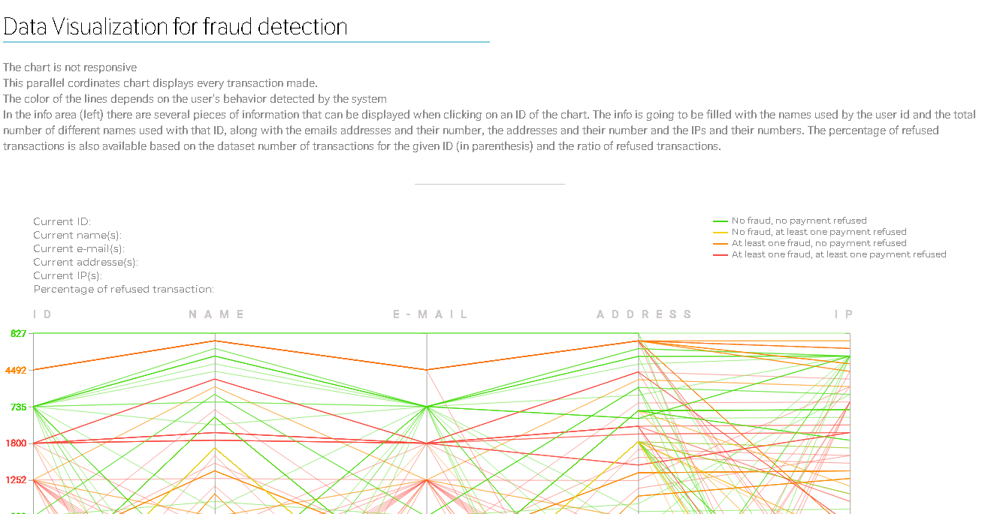

# Fraud Detection VIz  

- This parallel coordinates chart displays every transaction made.  
- The color of the lines depends on the user's behavior detected by the system  
- In the info area (left) there are several pieces of information that can be displayed when clicking on an ID of the chart.  
- The info is going to be filled with the names used by the user id and the total number of different names used with that ID, along with the emails addresses and their number, the addresses and their number and the IPs and their numbers.  
- The percentage of refused transactions is also available based on the dataset number of transactions for the given ID (in parenthesis) and the ratio of refused transactions  
    
    
Best on Chrome based browsers :)  
Ok with Firefox (animations are laggy)    
Ok with Edge  
Not supported on IE  
(the chart is not responsive)

